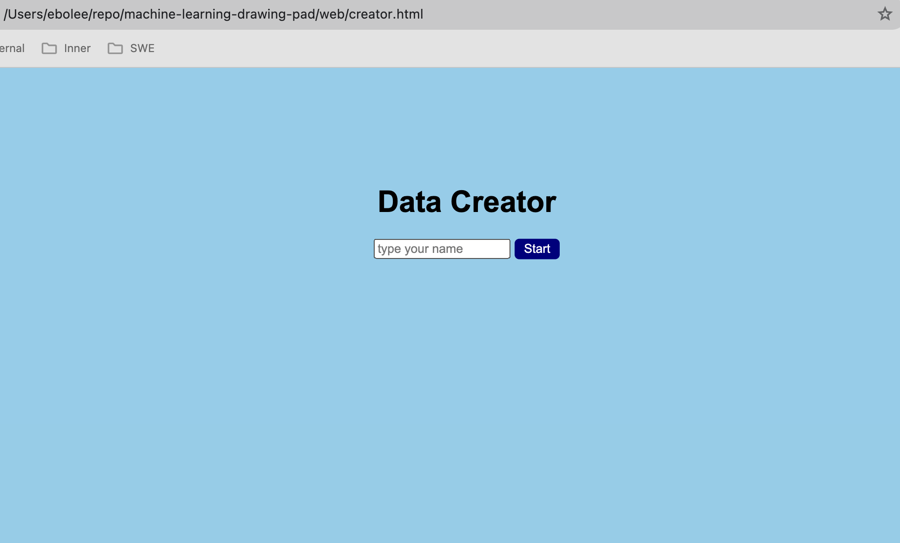
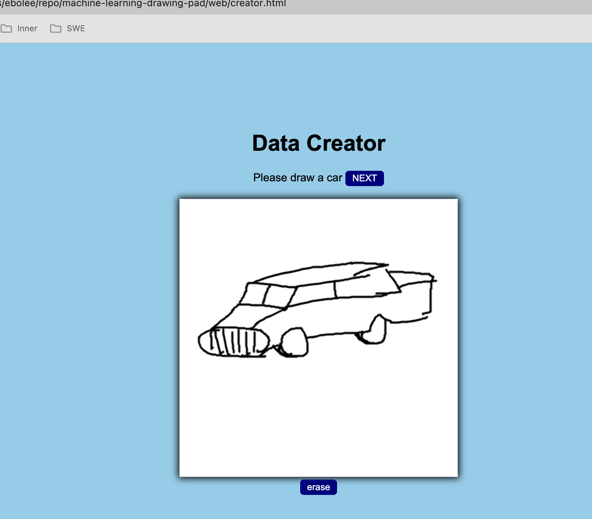
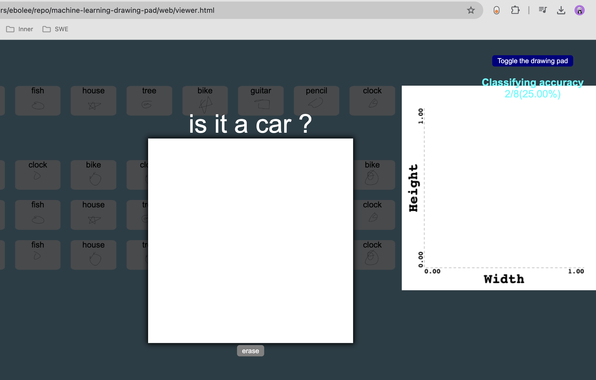
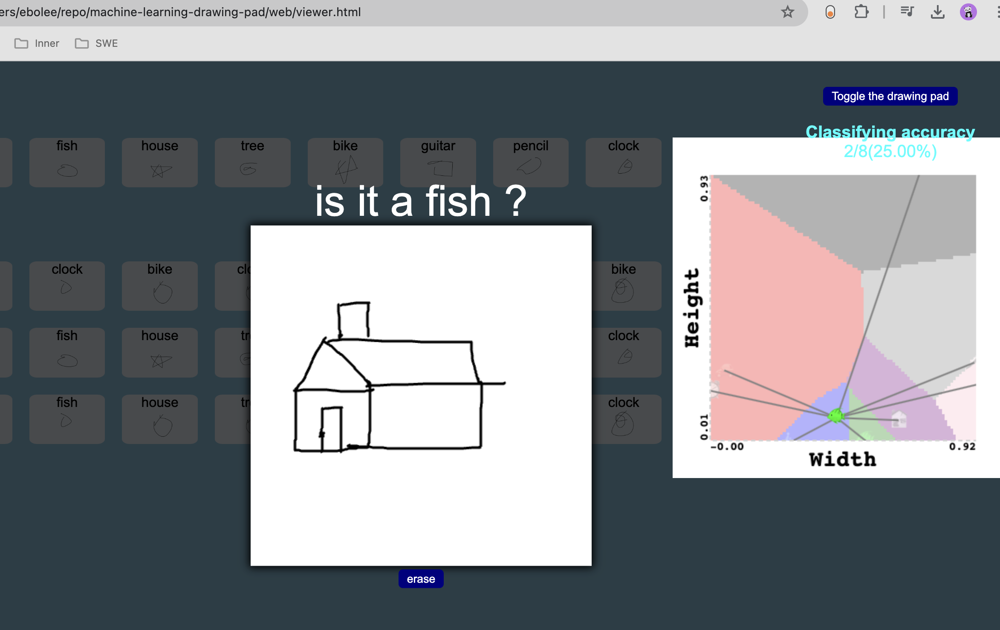
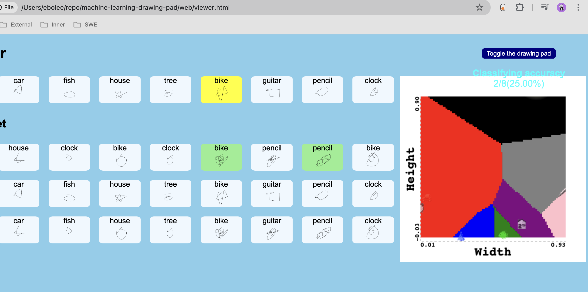

# A web app that learns to recognize drawings

###

this app is built with javascript, css, html with minimum libraries with an intention to gain deep understanding of machine learning systems

## features

- drawing pad
- Get data from users' drawing
- visualize data
- extract features
- scatter plot
- custom chart
- classify the nearest neighbor
- scale data
- classify data with K nearest neighbor
- evaluate model accuracy
- decision boundaries
- use Python and SkLearn

##

